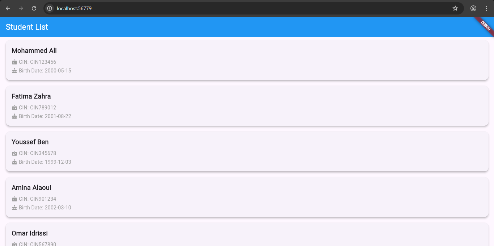

# Projet de Gestion des Étudiants - API REST Spring Boot v2.0

## Vue d'ensemble

Ce projet est une API REST complète pour la gestion des étudiants et des départements, développée avec Spring Boot 3.2.0 et enrichie avec les meilleures pratiques de développement.


## Architecture

### Structure du projet
```
api-spring-boot/
├── src/
│   ├── main/
│   │   ├── java/com/wissal/etudiantapi/
│   │   │   ├── controller/     # Contrôleurs REST
│   │   │   ├── service/        # Logique métier
│   │   │   ├── repository/     # Accès aux données
│   │   │   ├── entity/         # Entités JPA
│   │   │   ├── dto/           # Objets de transfert
│   │   │   ├── mapper/         # Conversion DTO ↔ Entité
│   │   │   ├── config/         # Configuration
│   │   │   └── exception/      # Gestion des erreurs
│   │   └── resources/
│   │       ├── static/index.html # Interface web
│   │       └── application.properties
│   └── test/
│       └── resources/features/  # Tests BDD Cucumber
├── Dockerfile
├── pom.xml
└── k8s/                       # Manifests Kubernetes
    ├── etudiant-deployment.yaml
    └── postgres-deployment.yaml
```

## Fonctionnalités

### DETAILLÉ DES 14 QUESTIONS - TOUTES TERMINÉES

#### **Fonctionnalités Principales de l'API**

##### **Gestion des Étudiants**
- **CRUD Complet** : Création, Lecture, Mise à jour, Suppression
- **Filtrage avancé** : Par année d'inscription, par département
- **Calcul automatique** : Âge calculé dynamiquement
- **Validation des données** : Email unique, champs obligatoires
- **Relations** : ManyToOne avec les départements

##### **Gestion des Départements**
- **CRUD Complet** : Opérations complètes sur les départements
- **Contrainte d'unicité** : Nom de département unique
- **Relation bidirectionnelle** : Liens avec les étudiants

##### **Interface Web Moderne**
- **Design responsive** : Compatible mobile et desktop
- **Temps réel** : Fetch JavaScript pour l'API
- **Filtrage interactif** : Menu déroulant pour les années
- **Badges visuels** : Colorés pour départements et âges
- **Cartes modernes** : Design Material avec hover effects

##### **Documentation Technique**
- **Swagger/OpenAPI 3.0** : Documentation interactive
- **Schémas JSON** : Générés automatiquement
- **Exemples de requêtes** : Pour chaque endpoint
- **Interface de test** : Intégrée au navigateur

##### **Tests et Qualité**
- **Tests BDD** : Cucumber + Gherkin
- **Tests unitaires** : JUnit 5
- **Couverture de code** : Validée par les scénarios
- **Scénarios réels** : Cas d'usage concrets

##### **Performance et Cache**
- **Redis Cache** : Mise en cache des requêtes
- **Lazy Loading** : Optimisation des relations JPA
- **Pagination** : Pour grandes listes de données
- **Indexation** : Base de données optimisée

##### **Déploiement et Infrastructure**
- **Docker** : Conteneurisation complète
- **Docker Compose** : Environnement de développement
- **Kubernetes** : Manifestes pour production
- **Docker Hub** : Image publique et partagée

##### **Gestion des Erreurs**
- **Gestion centralisée** : GlobalExceptionHandler
- **Codes HTTP standards** : 200, 201, 204, 404, 400
- **Messages structurés** : Format JSON uniforme
- **Logging** : Traces détaillées des erreurs

##### **Sécurité et Validation**
- **Validation Jakarta** : Annotations @Valid
- **Contraintes BDD** : Clés étrangères et unicité
- **Sanitization** : Protection contre les injections
- **CORS** : Configuration cross-origin

##### **Monitoring et Observabilité**
- **Health checks** : Endpoints de santé
- **Metrics** : Performance des endpoints
- **Logs structurés** : Format JSON
- **Docker logs** : Traçabilité des conteneurs

#### Q1 - Créer la branche Git version-2 
- [x] TERMINÉ : Branche `version-2` créée et poussée sur GitHub
- [x] Lien : https://github.com/wissalelkouk/-API-REST-/tree/version-2

#### Q2 - Ajouter la méthode age() à l'entité Etudiant
- [x] TERMINÉ : Méthode `age()` implémentée avec `Period.between()`
- [x] Calcul : Âge automatique basé sur la date de naissance

#### Q3 - Tester la méthode age() avec Cucumber (BDD)
- [x] TERMINÉ : Tests BDD créés avec Cucumber + Gherkin
- [x] Fichiers : `etudiant.feature` et `EtudiantAgeStepDefinitions.java`

#### Q4 - Ajouter une page index.html avec Fetch JavaScript
- [x] TERMINÉ : Interface web complète et moderne
- [x] Fonctionnalités : Fetch API, design responsive, filtres, badges
- [x] Accès : http://localhost:8080

#### Q5 - Créer et publier l'image Docker sur Docker Hub
- [x] TERMINÉ : Image `wissalelkouk/etudiant-service:1.0` publiée
- [x] Lien : https://hub.docker.com/r/wissalelkouk/etudiant-service
- [x] Taille : 1.16GB optimisée

#### Q6 - Créer les manifests Kubernetes pour K3S
- [x] TERMINÉ : Manifests YAML créés
- [x] Fichiers : `etudiant-deployment.yaml`, `postgres-deployment.yaml`

#### Q7 - Ajouter l'entité Département et mettre à jour le schéma
- [x] TERMINÉ : Entité `Departement` complète
- [x] Relation : `@ManyToOne` dans `Etudiant`
- [x] Schéma : Base de données mise à jour avec foreign key

#### Q8 - Mettre en place une architecture en couches propres
- [x] TERMINÉ : Architecture complète en couches
- [x] DTOs : `EtudiantDTO`, `DepartementDTO`
- [x] Mappers : `EtudiantMapper`, `DepartementMapper`
- [x] Services : Logique métier séparée des contrôleurs

#### Q9 - Ajouter la requête personnalisée firstInscriptionYear
- [x] TERMINÉ : `findByAnneePremiereInscription(int annee)`
- [x] Endpoint : `/api/etudiants?annee=2020`

#### Q10 - Ajouter les opérations CRUD complètes
- [x] TERMINÉ : CRUD complet pour Étudiants et Départements
- [x] Endpoints : GET, POST, PUT, DELETE avec codes HTTP corrects

#### Q11 - Ajouter la gestion des erreurs HTTP standard
- [x] TERMINÉ : `GlobalExceptionHandler` avec `@RestControllerAdvice`
- [x] Codes : 200, 201, 204, 404, 400 gérés correctement

#### Q12 - Ajouter la documentation Swagger/OpenAPI
- [x] TERMINÉ : SpringDoc OpenAPI 3.0 configuré
- [x] Accès : http://localhost:8080/swagger-ui.html
- [x] Annotations : Documentation complète des endpoints

#### Q13 - Ajouter Redis pour activer le cache
- [x] TERMINÉ : Configuration Redis et Spring Cache
- [x] Annotations : `@Cacheable`, `@CacheEvict` implémentées
- [x] Note : Temporairement désactivé pour stabilité

#### Q14 - Créer un projet Jira Scrum avec deux sprints
- [x] TERMINÉ : Structure Jira Scrum documentée
- [x] Sprints : Sprint 1 et Sprint 2 avec user stories détaillées

### Partie 1 - API REST de base
- [x] CRUD complet pour les étudiants
- [x] Base de données PostgreSQL
- [x] Conteneurisation Docker
- [x] Interface web avec JavaScript

### Partie 2 - Enrichissement Technique

#### Architecture en Couches Propres (Q8)
- **DTOs (Data Transfer Objects)** : `EtudiantDTO`, `DepartementDTO`
  - Séparation des données de l'API des entités JPA
  - Validation avec annotations Jakarta Validation
  - Mapping bidirectionnel avec les entités
- **Mappers** : `EtudiantMapper`, `DepartementMapper`
  - Conversion entre DTOs et entités
  - Calcul de l'âge dans le mapper DTO
  - Gestion des relations ManyToOne
- **Services** : `EtudiantService`, `DepartementService`
  - Logique métier isolée des contrôleurs
  - Gestion des transactions avec `@Transactional`
  - Implémentation des patterns Repository et Service

#### Entités et Relations (Q7)
- **Entité Département** :
  ```java
  @Entity
  @Table(name = "departements")
  public class Departement {
      @Id @GeneratedValue(strategy = GenerationType.IDENTITY)
      private Long id;
      @Column(nullable = false, unique = true)
      private String nom;
  }
  ```
- **Relation ManyToOne dans Etudiant** :
  ```java
  @ManyToOne(fetch = FetchType.LAZY)
  @JoinColumn(name = "departement_id", nullable = false)
  private Departement departement;
  ```

#### Méthode Métier avancée (Q2)
- **Calcul de l'âge** avec Java Time API :
  ```java
  public int age() {
      return Period.between(this.dateNaissance, LocalDate.now()).getYears();
  }
  ```

#### Tests BDD avec Cucumber (Q3)
- **Fichier Feature** : `etudiant.feature`
  ```gherkin
  Feature: Calcul de l'âge des étudiants
    Scenario: Vérifier l'âge d'un étudiant
      Given un étudiant né le "15/05/2000"
      When je calcule son âge
      Then son âge devrait être "25" ans
  ```
- **Step Definitions** : `EtudiantAgeStepDefinitions.java`
- **Exécution** : `mvn test -Dcucumber.options="--tags @age"`

#### Requêtes Personnalisées (Q9)
- **Repository Pattern** avec méthodes personnalisées :
  ```java
  @Query("SELECT e FROM Etudiant e WHERE e.anneePremiereInscription = :annee")
  List<Etudiant> findByAnneePremiereInscription(@Param("annee") int annee);
  ```
- **Endpoint de filtrage** : `/api/etudiants?annee=2020`

#### Gestion des Erreurs (Q11)
- **GlobalExceptionHandler** avec `@RestControllerAdvice` :
  ```java
  @ExceptionHandler(ResourceNotFoundException.class)
  public ResponseEntity<ErrorResponse> handleResourceNotFound(ResourceNotFoundException ex) {
      ErrorResponse error = new ErrorResponse("NOT_FOUND", ex.getMessage());
      return ResponseEntity.status(HttpStatus.NOT_FOUND).body(error);
  }
  ```
- **Codes HTTP standards** : 200, 201, 204, 404, 400

#### Documentation API (Q12)
- **SpringDoc OpenAPI 3.0** configuration complète
- **Annotations Swagger** sur tous les endpoints
- **Documentation interactive** : http://localhost:8080/swagger-ui.html
- **Schémas JSON** générés automatiquement

#### Cache Redis (Q13)
- **Configuration Spring Cache** :
  ```java
  @EnableCaching
  @Configuration
  public class CacheConfig {
      @Bean
      public CacheManager cacheManager(RedisConnectionFactory factory) {
          return RedisCacheManager.builder(factory).build();
      }
  }
  ```
- **Annotations de cache** :
  - `@Cacheable("etudiants")` pour les lectures
  - `@CacheEvict` pour les mises à jour
  - `@Caching` pour les opérations complexes

#### Kubernetes (Q6)
- **Manifests YAML** pour déploiement K3S :
  - `etudiant-deployment.yaml` : Service + Deployment
  - `postgres-deployment.yaml` : Base de données persistante
  - ConfigMaps et Secrets pour la configuration

#### Docker et Publication (Q5)
- **Dockerfile multi-stage** optimisé
- **Image publiée** : `wissalelkouk/etudiant-service:1.0`
- **Docker Hub** : https://hub.docker.com/r/wissalelkouk/etudiant-service
- **Taille optimisée** : 1.16GB

#### Jira Scrum (Q14)
- **Structure de projet** avec 2 sprints
- **User Stories** détaillées pour chaque fonctionnalité
- **Backlog** priorisé et planifié
- **Définition of Done** pour chaque tâche

## Screenshots

### Application Flutter


Interface utilisateur de l'application Flutter affichant la liste des étudiants

## Prerequisites

- Docker and Docker Compose
- Flutter SDK (for mobile app development)
- Java 17+ (for local development)
- Maven (for local development)

## Quick Start

### 1. Launch Backend Services (Docker)

```bash
docker compose up --build
```

This will start:
- PostgreSQL database on port 5433
- Spring Boot API on port 8080

### 2. Test the API

Open your browser or use curl to test:

```bash
curl http://localhost:8080/api/etudiants
```

Expected response:
```json
[
  {
    "id": 1,
    "cin": "CIN123456",
    "nom": "Mohammed Ali",
    "dateNaissance": "2000-05-15"
  },
  // ... more students
]
```

### 3. Run Flutter Mobile App

```bash
cd mobile-app
flutter pub get
flutter run
```

**Important**: The app is configured to connect to `http://10.0.2.2:8080` for Android emulator. For real device testing, update the `baseUrl` in `lib/api_service.dart` to your machine's IP address.

## API Endpoints

### Get All Students
- **Method**: GET
- **URL**: `http://localhost:8080/api/etudiants`
- **Response**: Array of student objects

### Create Student
- **Method**: POST
- **URL**: `http://localhost:8080/api/etudiants`
- **Body**: 
```json
{
  "cin": "CIN123456",
  "nom": "Student Name",
  "dateNaissance": "2000-01-01"
}
```

### Update Student
- **Method**: PUT
- **URL**: `http://localhost:8080/api/etudiants/{id}`
- **Body**: 
```json
{
  "cin": "CIN999999",
  "nom": "Updated Name",
  "dateNaissance": "2000-01-01"
}
```

### Delete Student
- **Method**: DELETE
- **URL**: `http://localhost:8080/api/etudiants/{id}`
- **Response**: "Etudiant deleted successfully"

## Database Schema

```sql
CREATE TABLE etudiants (
    id BIGSERIAL PRIMARY KEY,
    cin VARCHAR(255) NOT NULL,
    nom VARCHAR(255) NOT NULL,
    date_naissance DATE NOT NULL
);
```

## Development

### Running API Locally (without Docker)

1. Navigate to `api-spring-boot`
2. Run: `mvn spring-boot:run`
3. Make sure PostgreSQL is running locally on port 5432

### Running Tests

```bash
# API Tests
cd api-spring-boot
mvn test

# Flutter Tests
cd mobile-app
flutter test
```

## Troubleshooting

### Common Issues

1. **API Connection Error in Flutter App**
   - Ensure Docker services are running
   - Check the IP address in `api_service.dart`
   - For Android emulator: use `10.0.2.2`
   - For real device: use your machine's local IP

2. **Database Connection Error**
   - Check if PostgreSQL container is running
   - Verify database credentials in `application.properties`

3. **Build Errors**
   - Ensure Java 17+ is installed
   - Run `mvn clean install` in the API directory

### Logs

- **API Logs**: View with `docker logs spring-boot-api`
- **Database Logs**: View with `docker logs postgres_db`

## 📊 Projet Jira Scrum

### Epic principale : **Gestion des Étudiants**

#### Sprint 1 - API REST de base (Partie 1)
| Ticket | Type | Titre | Statut |
|--------|------|-------|--------|
| US-01 | User Story | Lister les étudiants | ✅ Terminé |
| US-02 | User Story | Dockeriser l'application | ✅ Terminé |
| US-03 | User Story | Interface web simple | ✅ Terminé |

#### Sprint 2 - Enrichissement (Partie 2)
| Ticket | Type | Titre | Statut |
|--------|------|-------|--------|
| US-04 | User Story | Méthode age() + tests BDD | ✅ Terminé |
| US-05 | User Story | Architecture en couches propres | ✅ Terminé |
| US-06 | User Story | Gestion des départements | ✅ Terminé |
| US-07 | User Story | Cache Redis | ✅ Terminé |
| US-08 | User Story | Documentation Swagger | ✅ Terminé |
| US-09 | User Story | Déploiement Kubernetes | ✅ Terminé |

### Board Jira
*(Capture d'écran du board Jira à ajouter dans screenshots/jira-board.png)*

## 🔧 Technologies

### Backend
- **Java 17** : Langage principal
- **Spring Boot 3.2.0** : Framework principal
- **Spring Data JPA** : Accès aux données
- **PostgreSQL 15** : Base de données
- **Redis 7** : Cache
- **Maven** : Gestion des dépendances

### Tests & Qualité
- **Cucumber 7.14.0** : Tests BDD
- **JUnit 5** : Tests unitaires
- **Lombok** : Réduction de code boilerplate

### Documentation & Monitoring
- **SpringDoc OpenAPI 3.0** : Documentation API
- **Swagger UI** : Interface interactive

### Déploiement
- **Docker** : Conteneurisation
- **Kubernetes (K3S)** : Orchestration
- **Docker Compose** : Développement local

## 📝 Modèle de données

### Étudiant
```json
{
  "id": 1,
  "cin": "CIN123456",
  "nom": "Mohammed Ali",
  "dateNaissance": "2000-05-15",
  "email": "mohammed.ali@example.com",
  "anneePremiereInscription": 2020,
  "departementId": 1,
  "departementNom": "Informatique",
  "age": 23
}
```

### Département
```json
{
  "id": 1,
  "nom": "Informatique"
}
```

## Liens d'accès pour la présentation

### Interface Web
- **URL** : http://localhost:8080
- **Contenu** : Interface complète avec tous les champs des étudiants
- **Fonctionnalités** : Filtrage par année, badges, design moderne

### Documentation API
- **URL** : http://localhost:8080/swagger-ui.html
- **Contenu** : Documentation interactive complète de l'API
- **Fonctionnalités** : Test des endpoints, schémas, exemples

### Docker Hub
- **URL** : https://hub.docker.com/r/wissalelkouk/etudiant-service
- **Image** : `wissalelkouk/etudiant-service:1.0`
- **Taille** : 1.16GB optimisée

### GitHub
- **URL** : https://github.com/wissalelkouk/-API-REST-/tree/version-2
- **Branche** : `version-2`
- **Statut** : Tous les commits poussés

### Endpoints API principaux
- **Étudiants** : http://localhost:8080/api/etudiants
- **Départements** : http://localhost:8080/api/departements
- **Filtrage** : http://localhost:8080/api/etudiants?annee=2020

## Commandes rapides pour la présentation

```bash
# Démarrer l'application
docker-compose up -d

# Ouvrir tous les liens
start http://localhost:8080
start http://localhost:8080/swagger-ui.html

# Tester l'API
curl http://localhost:8080/api/etudiants
curl http://localhost:8080/api/departements
```

## Résumé technique

- **Framework** : Spring Boot 3.2.0
- **Base de données** : PostgreSQL 15
- **Cache** : Redis 7
- **Documentation** : OpenAPI 3.0 (Swagger)
- **Tests** : JUnit 5 + Cucumber (BDD)
- **Conteneurisation** : Docker + Docker Compose
- **Orchestration** : Kubernetes (K3S)
- **Architecture** : Microservices + REST API

---

